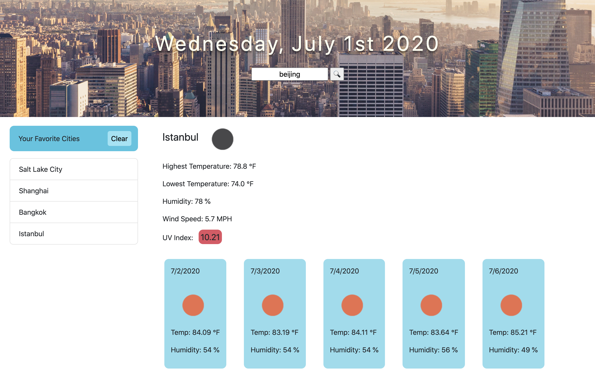

# Weather Dashboard

## Description and Usage
The Weather Dashboard is a browser application that takes user input and returns the weather condition of searched city. This application provides some useful features such as UV index level, a 5-day forecast and cities history. With the help of this application, I indend to make weather searching easier and more personalized for my users.

## Link to Deployed Application
https://dilanli.github.io/Weather-Dashboard/

## APIs
[Moment.js](https://momentjs.com/)  

[OpenWeather API](https://openweathermap.org/api)
- Current Weather Data
- One Call API

## Credit
city background picture:  
@jonathan_christian.photography  
Unsplash link: https://unsplash.com/photos/VW8MUbHyxCU
